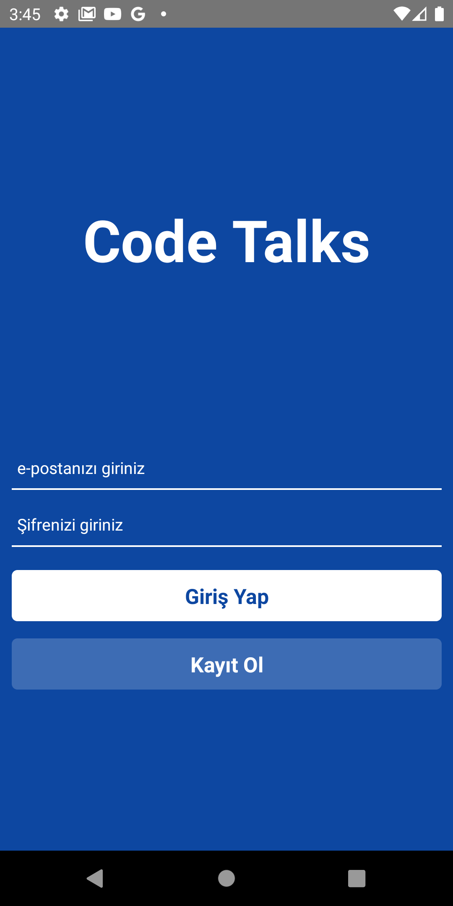
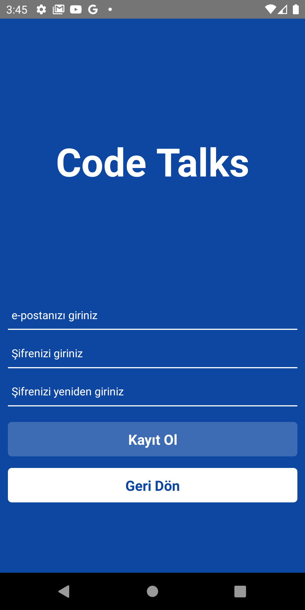
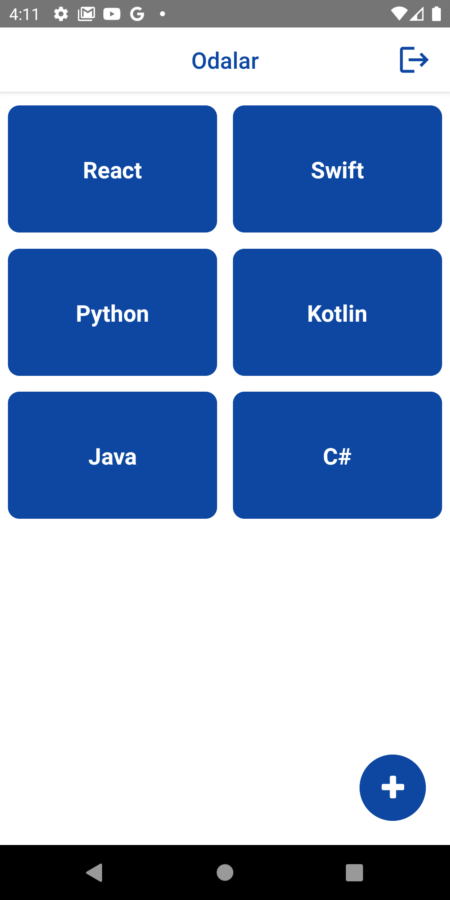
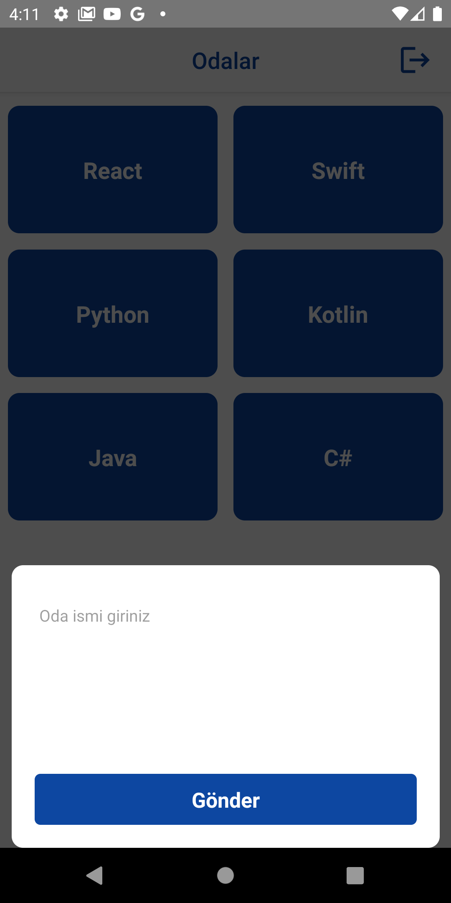
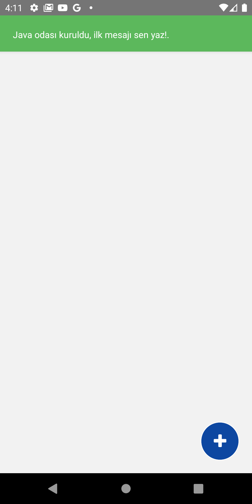
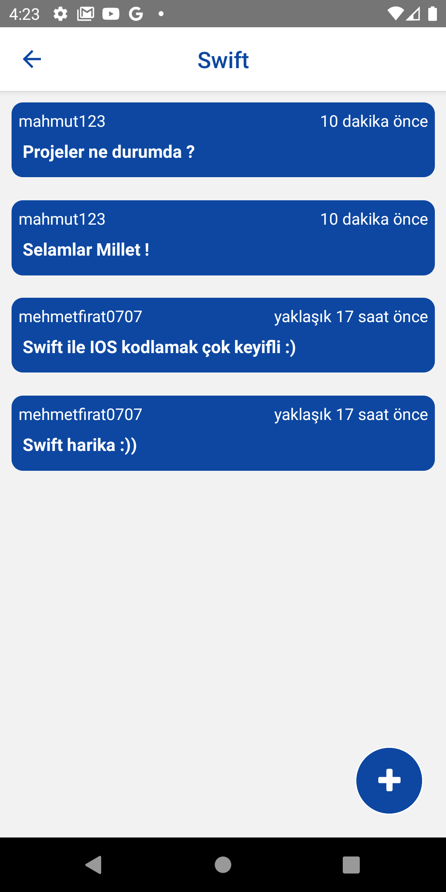
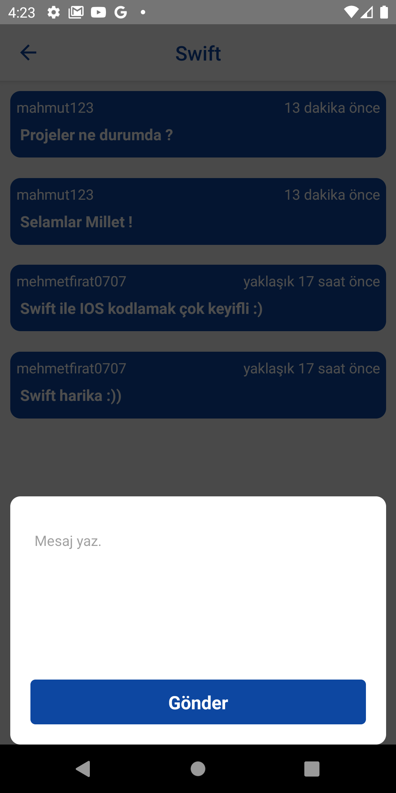

# CodeTalks
     

 


CodeTalks yazılım alanıyla ilgili olan herkesi bir araya getirip, diledikleri konularda sohbet odaları açmayı veya açılan odalarda keyifli muhabbetler yapılmasını sağlayan bir mobil uygulamadır.
## Kurulum
React Native
## Tools
* Firebase
* React Navigation
* Formik
* React Native Flash Message
* React Native Modal
* React Native Vector Icons
## Özellikler
* Kayıt formu ile sisteme üye olabilmek.
* Kayıt olunan bilgiler ile sisteme giriş yapabilmek.
* Sohbet odasını oluşturabilmek.
* Oluşturulan odalarda sohbet edebilmek.
## Başlangıç
Bu depoyu yerel bilgisayatınıza klonlayın.
Some basic Git commands are:
```
gh repo clone mehmetfiratkahvecioglu/Code-Talks
```
## Kullanım
Projeyi klonladıktan sonra kullanmak için:
```
npm init
npm install
```
Bu talimatlar, geliştirme ve test amacıyla yerel makinenizde projenin bir kopyasını hazır ve çalışır hale getirecektir.
## Kullanılabilir Komut Dosyaları
Proje dizininde şunları çalıştırabilirsiniz:
```
npx react-native run-android
```
## Daha fazla bilgi için :
Daha fazlasını şuradan öğrenebilirsiniz [React Native Documentation](https://github.com/ibrahimaykutbas/CodeTalks)
